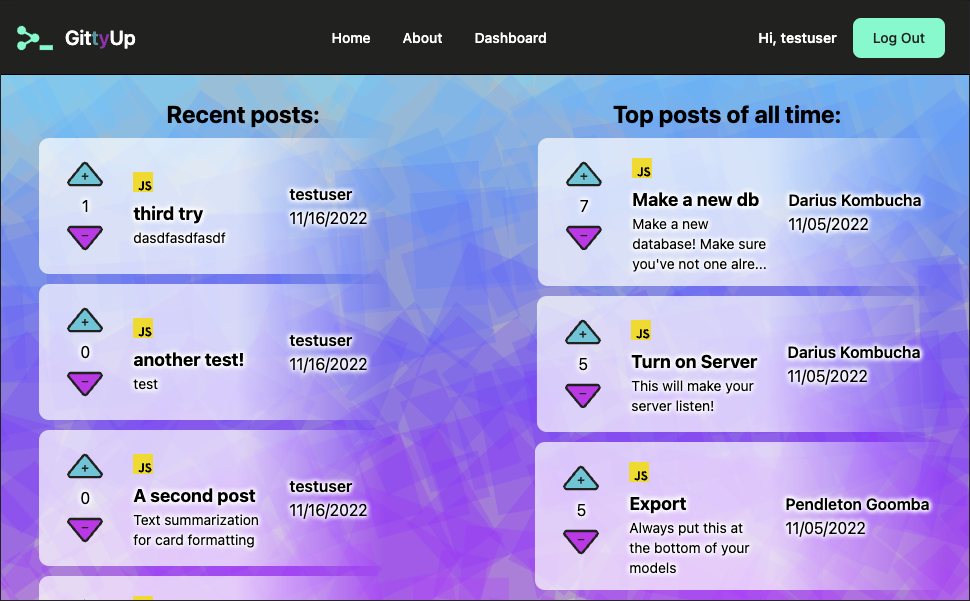

# GittyUp

 

## Description

A website for sharing your code, get it? Git it? Oh well, we like puns...

 The website acts largely as a forum for sharing code snippets that others can comment and vote on. Browse highly ranked code for a language of your choice to see what functionaility others have made and what you may want ot include in your next project!

Deployed project: https://tranquil-eyrie-15534.herokuapp.com/

## Table of Contents

- [Installation](#installation)
- [Usage](#usage)
- [Tests](#tests)
- [Contributing](#contributing)
- [Questions](#questions)
- [License](#license)
- [Credits](#credits)

## Installation

Run "npm i" in the project directory after cloning. Set up the mysql db schema (./db/schema). Populate seed data with "npm run seed". Execute a safety build of tailwind with "npm run tailwindcss".

## Usage

Run "node server" to start the server. Navigate to localhost:3001 (if being run locally) to get to the website and browse around. Sign up an account to make new submissions, add comments to submissions, or vote on submissions on the front page.

## Tests

No tests implemented at this time

## Contributing

Not taking contributions at this time, but feel free to fork.

## Questions

[Github: Gordon-Magill](https://github.com/Gordon-Magill) 
Email: gordon.magill@gmail.com
Please reach out via provided email for any questions.

## License

Licensed under [MIT](https://opensource.org/licenses/MIT).

## Credits

[Gordon Magill](https://github.com/Gordon-Magill) 
[Arielle Schlickman-Elak](https://github.com/arielle-elak/) 
[Chris Armstrong](https://github.com/CArmstrong2) 